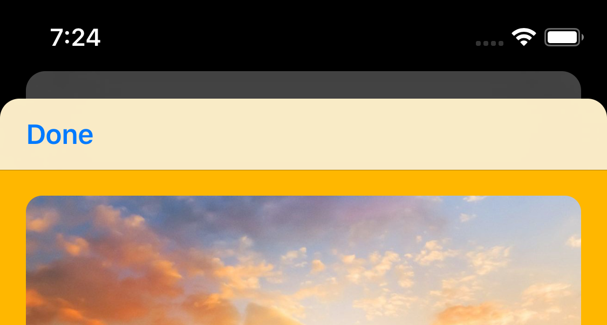
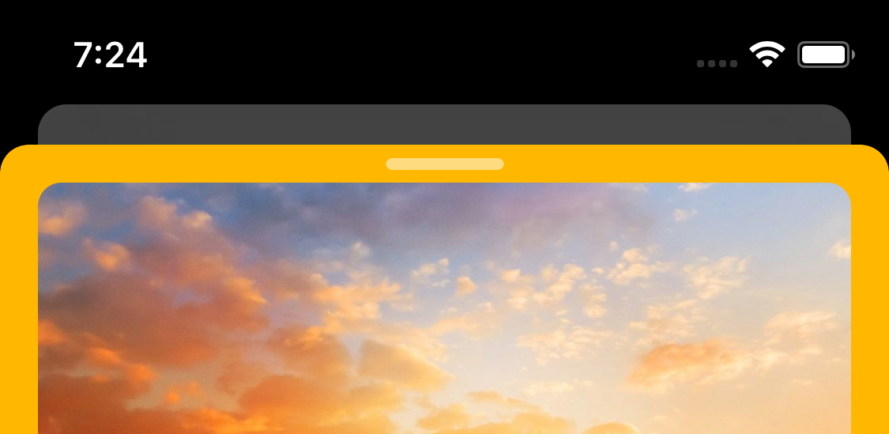

# CardPresentationController

Custom [UIPresentationController](https://developer.apple.com/documentation/uikit/uipresentationcontroller) which mimics the behavior of Apple Music UI.

## Usage

1. Add the folder `CardPresentationController` into your project

2. From anywhere you want to present a popup, call

```swift
let vc = ...
presentCard(vc, animated: true)
```

You dismiss it as any other presented UIVC:

```swift
dismiss(animated: true)
```

This will present `vc` modally, flying-in from bottom. Existing view will be kept shown as dimmed background card, on black background.

### Advanced behavior

If the _presenting_ controller was UINavigationController instance (which is the case in most apps) then its `barStyle` will be automatically changed to `.black`. So it looks dimmed.

If presenting VC is not UINavigationController instance, then its view will be 80% visible so it blends into the background a  bit, again looking dimmed.

In both cases that back "card" is inset a bit from the edges.



If the _presented_ VC is UINavigationController instance, nothing special happens. It's assumed that you will add bar button items which will facilitate dismissal.

If it is not, then CardPresentationController will automatically add a button at the middle of the shown card. Tapping on that will dismiss the cards.



### Status bar style

CardPresentationController tries its best to enforce `.lightContent` status bar style. You can help it, by adding this into your UIVC subclass:

```swift
override var preferredStatusBarStyle: UIStatusBarStyle {
	return .lightContent
}
```

If you are presenting UINC, then my advice is to subclass it and override `preferredStatusBarStyle` property in the same way.

## Requirements

Currently it's tested only on iOS. 

It requires iOS 11, since it uses [maskedCorners](https://developer.apple.com/documentation/quartzcore/calayer/2877488-maskedcorners) property to round the top corners only.

## How it works

The main object here is `CardTransitionManager`, which acts as  `UIViewControllerTransitioningDelegate`. 

If you don't supply it, CTM is internally instantiated and assigned as property on UIVC which called `presentCard()` – that's _sourceController_ in the UIPresentationController parlance.

This instance of CTM is automatically removed on dismissal.

CTM creates and manages the other two required objects:

* `CardPresentationController`: manages views and details of the custom presentation) and 
* `CardAnimator`: which actually performs the animated transition)

## Advanced example

If you want to control where the card originates — say if you want to mimic Apple Music's now-playing card — you can:

```swift
let vc = ContentController.instantiate()

let transitionManager = CardTransitionManager()
let f = container.convert(sender.bounds, to: view.window!)
transitionManager.initialTransitionFrame = f

presentCard(vc, 
		using: transitionManager, 
		animated: true)
```

The important bit here is setting `initialTransitionFrame` property to the frame *in the UIWindow coordinating space*, since transition happens in it.

CardPresentationController can only animates the views – behavior of the internal views of the UIVCs you are presenting is up to you.
(I still need to figure that out, as it's obvious from the example).

## TODO

* interactivity (both for presenting and dismissing)
* improve landscape behavior
* more examples

## LICENSE

[MIT](LICENSE), as usual for all my stuff.